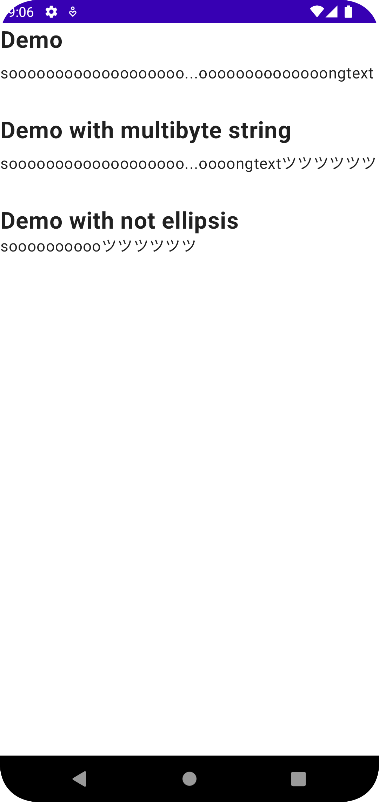

# MiddleEllipsisText

A Jetpack Compose Text Component with ellipsis in the middle of text.

If [Text](https://developer.android.com/reference/kotlin/androidx/compose/material/package-summary#Text(kotlin.String,androidx.compose.ui.Modifier,androidx.compose.ui.graphics.Color,androidx.compose.ui.unit.TextUnit,androidx.compose.ui.text.font.FontStyle,androidx.compose.ui.text.font.FontWeight,androidx.compose.ui.text.font.FontFamily,androidx.compose.ui.unit.TextUnit,androidx.compose.ui.text.style.TextDecoration,androidx.compose.ui.text.style.TextAlign,androidx.compose.ui.unit.TextUnit,androidx.compose.ui.text.style.TextOverflow,kotlin.Boolean,kotlin.Int,kotlin.Function1,androidx.compose.ui.text.TextStyle))
comes to support Text-overflow middle cropping, this library will be deprecated.

## Requirement

minSdkVersion: 24

## Installation

```kotlin
// settings.gradle(.kts)
pluginManagement {
  repositories {
    // ...
    mavenCentral()
  }
}

// {module}/build.gradle(.kts)
implementation "io.github.mataku:middle-ellipsis-text:${latestVersion}"
```

## Usage

```kotlin
MiddleEllipsisText(
  // required
  text = "yeah"
)
```

The same arguments can be specified as
for [Text](https://developer.android.com/reference/kotlin/androidx/compose/material/package-summary#Text(kotlin.String,androidx.compose.ui.Modifier,androidx.compose.ui.graphics.Color,androidx.compose.ui.unit.TextUnit,androidx.compose.ui.text.font.FontStyle,androidx.compose.ui.text.font.FontWeight,androidx.compose.ui.text.font.FontFamily,androidx.compose.ui.unit.TextUnit,androidx.compose.ui.text.style.TextDecoration,androidx.compose.ui.text.style.TextAlign,androidx.compose.ui.unit.TextUnit,androidx.compose.ui.text.style.TextOverflow,kotlin.Boolean,kotlin.Int,kotlin.Function1,androidx.compose.ui.text.TextStyle))
composable. See more
details: https://github.com/mataku/MiddleEllipsisText/blob/develop/MiddleEllipsisText/src/main/java/io/github/mataku/middleellipsistext/MiddleEllipsisText.kt

## Screenshot



## TODO

emoji with code point greater than or equal to 2 like country flag: 🇧🇪
