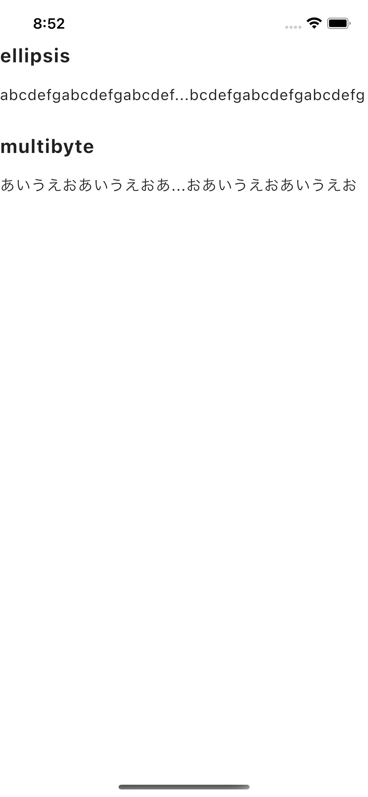
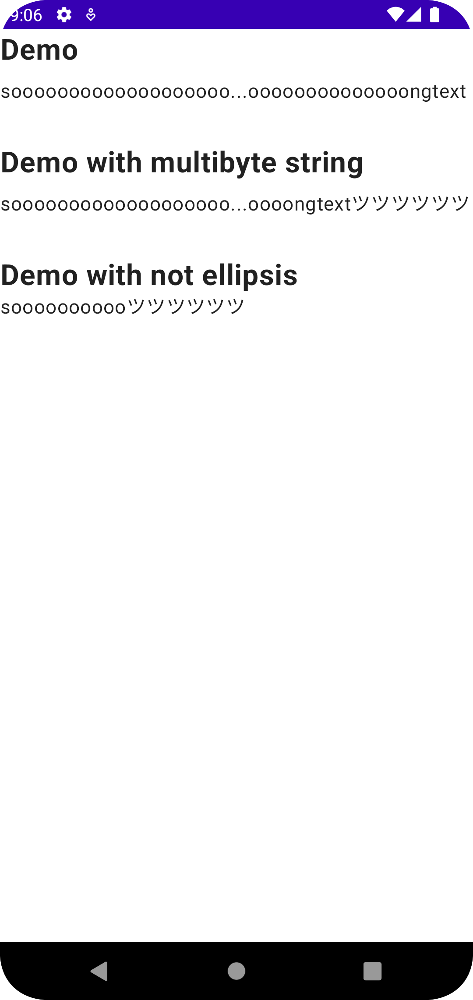
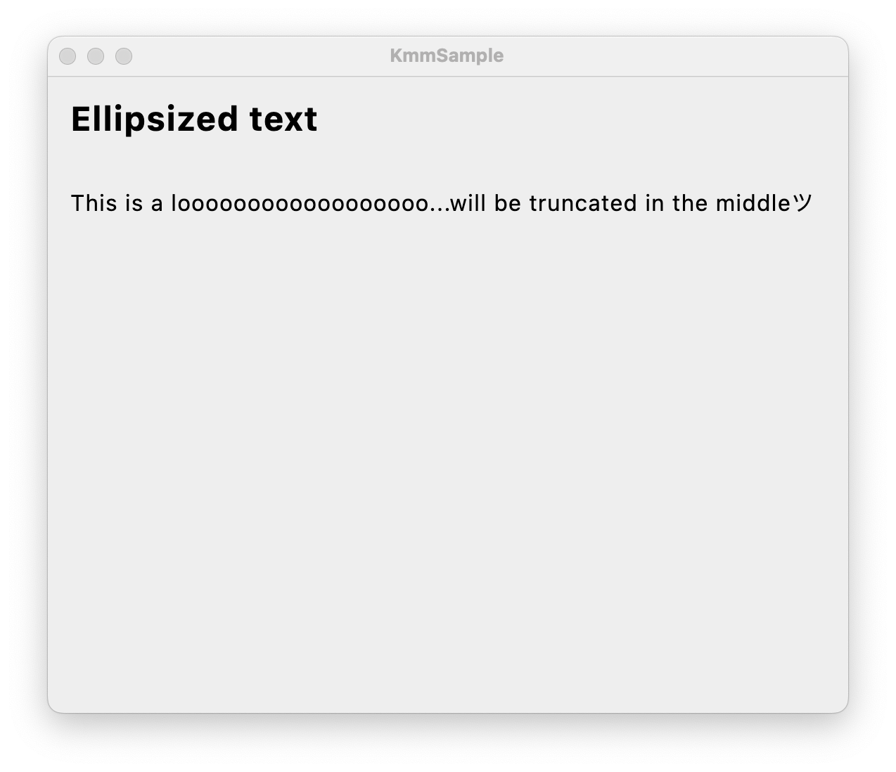

# Recommendation

From Compose 1.8.0(-alpha02), `MiddleEllipsis` TextOverflow has supported. It's better to use it if you don't need to customize ellipsis text or ellipsis text count.

```kotlin
Text(
  text = soLongText,
  modifier = Modifier,
  overflow = TextOverflow.MiddleEllipsis,
  maxLines = 1 // if you want single-line ellipsis
)
```

- - -

# MiddleEllipsisText


A Text Component with ellipsis in the middle of text for Jetpack Compose and Compose Multiplatform.

If [Text](https://developer.android.com/reference/kotlin/androidx/compose/material/package-summary#Text(kotlin.String,androidx.compose.ui.Modifier,androidx.compose.ui.graphics.Color,androidx.compose.ui.unit.TextUnit,androidx.compose.ui.text.font.FontStyle,androidx.compose.ui.text.font.FontWeight,androidx.compose.ui.text.font.FontFamily,androidx.compose.ui.unit.TextUnit,androidx.compose.ui.text.style.TextDecoration,androidx.compose.ui.text.style.TextAlign,androidx.compose.ui.unit.TextUnit,androidx.compose.ui.text.style.TextOverflow,kotlin.Boolean,kotlin.Int,kotlin.Function1,androidx.compose.ui.text.TextStyle))
comes to support Text-overflow middle cropping, this library will be deprecated.


## Requirement

minSdkVersion: 24

## Installation

```kotlin
// settings.gradle(.kts)
pluginManagement {
  repositories {
    // ...
    mavenCentral()
  }
}

// {module}/build.gradle(.kts)
implementation "io.github.mataku:middle-ellipsis-text:${latestVersion}"

// Material 3 Text
// implementation "io.github.mataku:middle-ellipsis-text3:${latestVersion}"

```

### Compose Multiplatform

MiddleEllipsisText and MiddleEllipsisText3 support Compose Multiplatform experimentally and only available for iOS, Android and JVM (desktop).

```kotlin
sourceSets {
  val commonMain by getting {
    dependencies {
      implementation("io.github.mataku:middle-ellipsis-text:${latestVersion}")
    }
  }
```

## Usage

```kotlin
MiddleEllipsisText(
  // required
  text = "yeah"
)
```

The same arguments can be specified as
for [Text](https://developer.android.com/reference/kotlin/androidx/compose/material/package-summary#Text(kotlin.String,androidx.compose.ui.Modifier,androidx.compose.ui.graphics.Color,androidx.compose.ui.unit.TextUnit,androidx.compose.ui.text.font.FontStyle,androidx.compose.ui.text.font.FontWeight,androidx.compose.ui.text.font.FontFamily,androidx.compose.ui.unit.TextUnit,androidx.compose.ui.text.style.TextDecoration,androidx.compose.ui.text.style.TextAlign,androidx.compose.ui.unit.TextUnit,androidx.compose.ui.text.style.TextOverflow,kotlin.Boolean,kotlin.Int,kotlin.Function1,androidx.compose.ui.text.TextStyle))
composable. See more
details: https://github.com/mataku/MiddleEllipsisText/blob/develop/MiddleEllipsisText/src/main/java/io/github/mataku/middleellipsistext/MiddleEllipsisText.kt

## Screenshot

| iOS | Android | Desktop |
| :--: | :--: | :--: |
|  |  |  |
